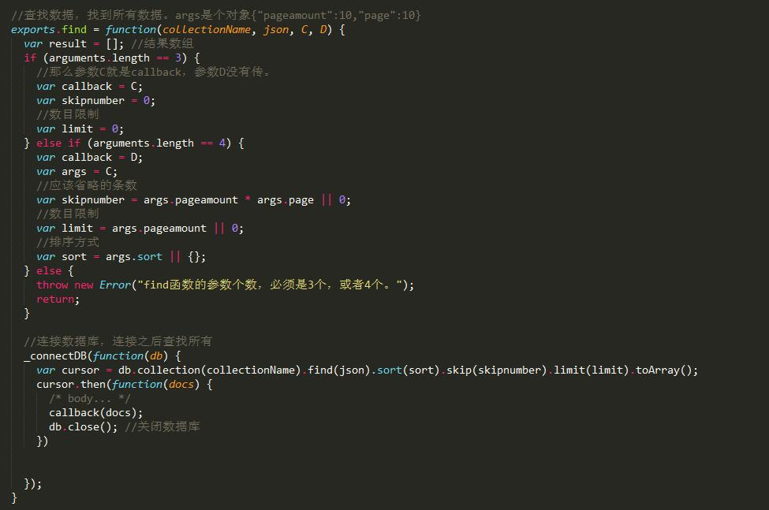

## express mongoDB 搭建了一个基础的留言板（增删改查）

### 1.下载运行：
* git clone  地址
* npm install 
* 开启数据库（mongod --storageEngine mmapv1 --dbpath C:\dev\mongoDB_data\cc_datas）
* node app 
* 访问3000端口

### 2.项目前言：
* 项目虽小，但是前后端所用的到最常用的包和写法都用到了。故麻雀小，五脏俱全。
* 后端：express搭的服务，接受post传递的两个包都用到了，formidable(可接受文件)，bady-parser(接受普通post提交的数据。)所有的数据操作都封装为model 的 dao层。文件下有两个文件，一个为普通的callback版本（db.js），一个为牛逼的promise版（cc_db.js）。
* 前端：逻辑还是用常用的面向对象，layer弹层，部分bootstrap样式，underscore模板引擎，还修改了部分源码。（原因：因为一开始设计后台的模板用了ejs模板引擎，其写法和underscore有冲突，故改了源码，但是后来后台抛弃模板引擎，直接进行数据交互，更符合现在的前后配合的编译流程，更其实改不改源码都行，至少知道怎么改~~嘿嘿）
* 看起来再简单的代码和逻辑也要亲手的敲一敲。中间有些小细节，又是发现不了的小错误。例如前端传回来的id,在操作数据库时传递的变量的字段为_id,前端的id值需要包装。
* 启动数据库：mongod --storageEngine mmapv1 --dbpath C:\dev\mongoDB_data\cc_datas （非官方解释就是因为mongoDB版本高，mongoVUE的读取引擎不适配，这样开启数据库，VUE就可以读取到数据库。）


### 3.前后开发
#### 3.1find：
* 前后同时开发就是根据自己的思路进行前后编程。首先是获取第一页的数据。
* 后台：/du 




* 前端：面向对象形式写的。


#### 3.2 add：

* 前端：用post方式进行提交


* 后台：采用formidable包进行post请求的处理


#### 3.3 delect：

* 前端：需要传递一个id值


* 后台：首先前端传递回来的id值后用mongoDB的ObjectID函数进行包装。mongoDB数据库里面的 _id 私有字段
```
var ObjectId = require('mongodb').ObjectID;
```


#### 3.4 update：

* 前端：需要传递一个id值,post提交请求


* 后台：后台处理post请求用body-parser这个包。单独对/update进行设置中间件。

```
app.post("/update", urlencodedParser, function(req, res) {...})
```


---------------------------
### 4.MIT   
###### 作者：cc.
